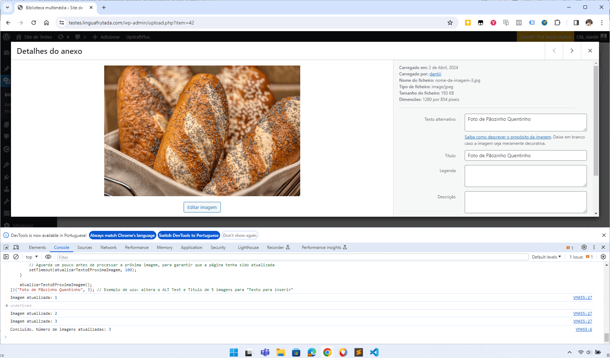

#  Change ALT and TITLE Images in WordPress Grid Multimedia



Author: Dante Marinho e ChatGPT v4

## Descrição do script  

A paritr de uma imagem do WordPress, em "grid mode", esse script altera uma sequência de imagens a partir desta 1ª imagem.

O script altera os campos ALT TEXT e o TITLE e em seguida clica no botão de passar para a próxima imagem à direita.

## Instruções de uso:  

01. Abrir uma imagem do WordPress no **grid mode**. Exemplo do link final: https://www.mywebsite.com/wp-admin/upload.php?item=42
02. No Google Chrome, abrir o Console
03. Inserir o código JavaScript e ter em atenção aos parâmetros necessários

Parâmetros:
- texto a ser adicionado
- limite de imagens para ser alterada

## Prompt realizado no ChatGPT

Crie um script JS para alterar vários ALT Text e Título de imagens no WordPress, com um mesmo texto.

O spript recebe um texto como parâmetros:
- O texto que deve ser inserido
- Um número, que será o limite de vezes que a ação será feita, ou seja, o número de imagens a ser modificada

O texto deverá ser inserido nos seguintes elementos:
- textarea com o id="attachment-details-two-column-alt-text"
- input com o id="attachment-details-two-column-title"

Após inserir o tesxto deverá clicar no elemento <button class="right dashicons"><span class="screen-reader-text">Editar item multimédia seguinte</span></button> para que passe para a próxima imagem.

RESPOSTA:

Aqui está um script JavaScript que pode ser utilizado para automatizar a tarefa de alterar o texto alternativo (ALT Text) e o título de várias imagens no WordPress. Este script é feito para ser executado no console do navegador enquanto estiveres na página de edição de mídia do WordPress. Assim, ele irá atualizar os campos ALT Text e Título para as imagens e, em seguida, navegar para a próxima imagem utilizando o botão específico.

(Versão inicial do código fornecida pelo ChatGPT)

```javascript
(function alterarTextosEmImagens(texto, limite) {
    let contador = 0;

    function atualizarTextoEProximaImagem() {
        if (contador >= limite) {
            console.log('Concluído. Número de imagens atualizadas:', contador);
            return;
        }

        // Encontrar e atualizar os campos de texto ALT e Título
        const campoAltText = document.getElementById("attachment-details-two-column-alt-text");
        const campoTitulo = document.getElementById("attachment-details-two-column-title");
        if (campoAltText && campoTitulo) {
            campoAltText.value = texto; // Atualiza o ALT Text
            campoTitulo.value = texto; // Atualiza o Título
            contador++;

            // Simula um evento 'change' para garantir que as mudanças sejam reconhecidas pelo WordPress
            ["change", "input"].forEach(event => {
                if (campoAltText.dispatchEvent && campoTitulo.dispatchEvent) {
                    var evt = new Event(event, { bubbles: true });
                    campoAltText.dispatchEvent(evt);
                    campoTitulo.dispatchEvent(evt);
                }
            });

            console.log('Imagem atualizada:', contador);
        }

        // Clica no botão para editar a próxima imagem
        const botaoProximaImagem = document.querySelector('button.right.dashicons');
        if (botaoProximaImagem) {
            botaoProximaImagem.click();
        }

        // Aguarda um pouco antes de processar a próxima imagem, para garantir que a página tenha sido atualizada
        setTimeout(atualizarTextoEProximaImagem, 1000);
    }

    atualizarTextoEProximaImagem();
})("Texto para inserir", 5); // Exemplo de uso: altera o ALT Text e Título de 5 imagens para "Texto para inserir"
```

Por favor, substitui "Texto para inserir" pelo texto que desejares utilizar e o 5 pelo número de imagens que queres modificar.

Nota importante: Antes de utilizar este script, é essencial estar ciente de que automações desse tipo devem ser usadas com cautela para evitar atualizações não intencionais ou em massa que possam afetar o conteúdo do site de maneira indesejada. Recomendo testar primeiramente em um ambiente de desenvolvimento ou de teste antes de executar em um ambiente de produção.